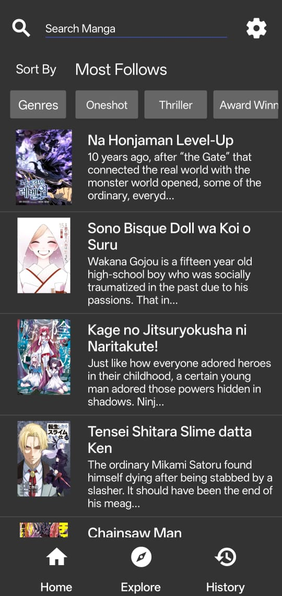
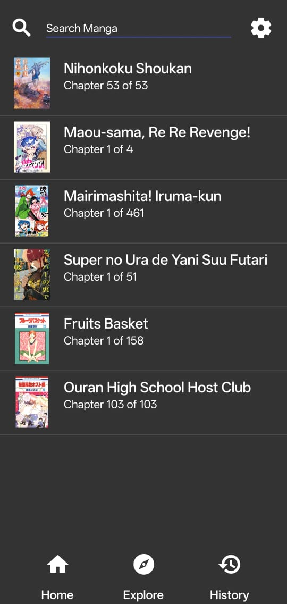
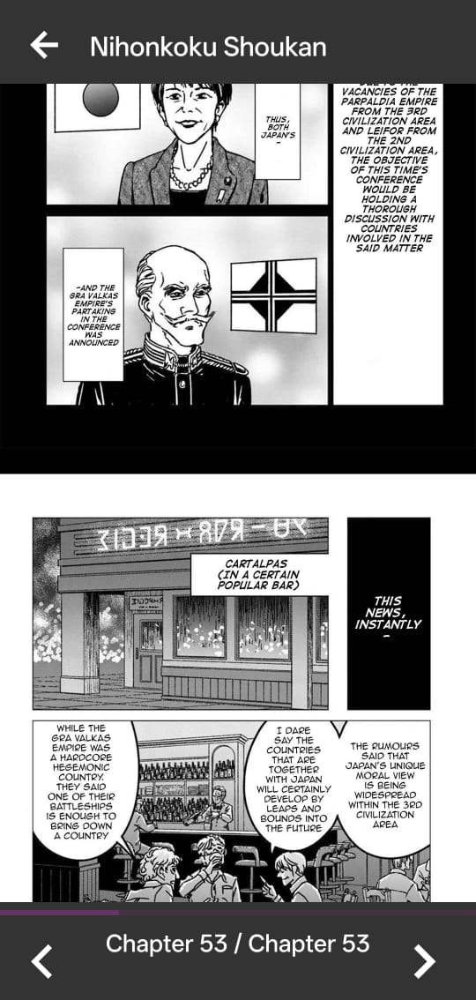

  

# Kasane

A simple open-source manga reader app created using Kodular because why not and it fun

## Features include

- [MangaDex](https://mangadex.org/) manga reader for Android 7+
- History tracking
- Use it own API to handle mangadex API (Useful for second sources)

## In-App Screenshot

## Limitation

Could be add/fix in future

- History won't be up to date when new chapter out
- No Favourate feature
- No offline reading
- One manga source only
- Support English Manga only
- Work on phone only cuz Kodular
- It so basic

## Contribution Note

Incase someone see this and know Kodular and decide to contribute are open to contribute:

- If you want to fix bugs or implement new features that already have an issue card: please assign this issue to you and/or comment about it.
- If you want to implement a new feature: open an issue or discussion regarding it to ensure it will be accepted.
- Since Kodular limit extensions to 5 for free plans, dont add any more extensions
- Please state what you did if pull request since it kodular

## Disclaimer

The developer(s) of this application do not have any affiliation with the content providers available, and this application hosts zero content.
